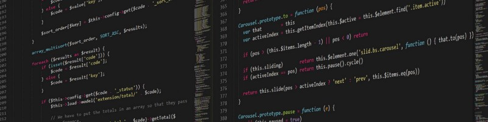

### Hi there 👋

    <h1> WHO AM I ?</h1>
    

        
    

    
My full name is Gabriel Sebastián Villarroel. I am a semi-senior Fullstack Web Developer with approximately 3 and a half years of experience. My first year of my education and experience as a programmer was of self-taught education and then continued with 3 years of professional experience. During the initial months of my self-directed learning, I engaged in Udemy courses and practiced algorithms with TypeScript for about six months. Subsequently, I enrolled in the Soy Henry Bootcamp for 4-5 months, where I worked on both individual and group projects, developing Single Page Applications (SPAs).
     
     
    Following this challenge, I worked as a backend developer for 6-7 months at Econocom-Gigigo (MX). This experience honed my ability to manage logic and solve advanced programming problems. Throughout that period, I had to acquire proficiency in multiple technologies, which fostered a great deal of autonomy within me. (I can tackle almost any task independently with just a bit of context regarding the requirements).
     
     
    Afterward, I spent 6-7 months on a real estate project through an agreement with the Technical University of Buenos Aires, where I served as a backend developer, providing support in both client-side and administrative user (CMS) areas.
     
     
    I then shifted my focus towards fullstack development and worked as a Semi-Senior Fullstack Developer at Latech LLC for 9-10 months. During this time, I conducted web layout based on designs and implemented numerous logical and large-scale resolutions for various company projects. I utilized integrations from different Node libraries and frameworks from specialized e-commerce companies like Outsmartly.
     
     
    Actually, i am working as a Fullstack Developer at Terratio since april 2024, a leading company offering an innovative platform to enhance sustainability in food production, particularly in tropical dry forests.
    From a young age, I've been passionate about acquiring new knowledge and solving problems, which is why I believe I can excel in any type of work environment.
     
     
    Here's a link to my portfolio: 
     
    💻 https://portfolio-rockijunior.vercel.app/
    
    My technical skills include:
    🔸 TypeScript
    🔸 JavaScript
    🔸 ReactJs
    🔸 Redux
    🔸 NodeJs
    🔸 NestJS
    🔸 Strappi
    🔸 Outsmartly-bento
    🔸 Express
    🔸 Sequelize
    🔸 TypeORM
    🔸 PostgreSQL
    🔸 MySQL
    🔸 MongoDB

    And my soft skills encompass:
    🔸 Communication
    🔸 Resilience and autonomy
    🔸 Creativity
    🔸 Leadership
    🔸 Proactivity
    🔸 Teamwork

    <h1>WHAT IM DOING?</h1>
    

    Actually, i am working as a Fullstack Developer at Terratio since april 2024, a leading company offering an innovative platform to enhance sustainability in food production, particularly in tropical dry forests. From a young age, I've been passionate about acquiring new knowledge and solving problems, which is why I believe I can excel in any type of work environment.

 

    If you're interested in contacting me, here's my information: 
     
    💻 gabrielvillarroel_11@hotmail.com 
     
    💻 gabriel776977@gmail.com 
     
    📱 +54 9 3472 -
    552354
     
     
👋 Warm regards from my side!
     

    <h1> CONTACTA CONMIGO</h1>
    

        
        
        
        
    

<!--
**RockiJunior/RockiJunior** is a ✨ _special_ ✨ repository because its `README.md` (this file) appears on your GitHub profile.

Here are some ideas to get you started:

- 🔭 I’m currently working on ...
- 🌱 I’m currently learning ...
- 👯 I’m looking to collaborate on ...
- 🤔 I’m looking for help with ...
- 💬 Ask me about ...
- 📫 How to reach me: ...
- 😄 Pronouns: ...
- ⚡ Fun fact: ...
-->
