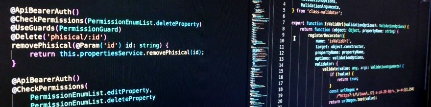

### Hi there 👋

    <h1> FULL STACK DEVELOPER </h1>
    
 Soy Gabriel Villarroel, de Villa María, Córdoba, Argentina. Me encanta ser desarrollador web, y aprender todo lo relacionado con nuevas tecnologias!, de las cuales estoy aún aprendiendo en el bootcamp de Henry (ya casi finalizado).  
    Estas son algunas de ellas:
       
     <b>HTML</b>, <b>CSS</b>, <b>React</b>-<b>Redux</b>, <b>NodeJS</b>, <b>Express</b>, <b>Sequelize</b>, <b>PostgreSQl</b> y   <b>Softs Skills</b> 
    como el trabajo en equipo, metodologías SCRUM, y mucho mas!

    <h1> ¿QUÉ ESTOY HACIENDO?</h1>
    

    - Aún estoy cursando el bootcamp de henry, y me encuentro finalizando la última etapa, a punto de empezar mi búsqueda laboral, para poder insertarme en un trabajo en el cual pueda aportar todos mis conocimientos, y crecer junto con el equipo que me requiera (realmente entusiasmado!)<n/>
    - Trabajamos y finalizamos un proyecto en un lapso de 3 semanas que consta de una aplicacion web para comprar y promocionar zapatos y zapatillas Premium de manera online.<n/>
        Integramos servicios y librerias como Mercado Pago, Multer-Cloudinary, Material UI, Json Web Token, Node.js, express, PostgreSQL, Sequelize, React-Redux, CSS, HTML.<n/>
    - Realizamos Deploy del Backend en Heroku, y Vercel para el Frontend. Aqui el enlace al deploy: https://drops.vercel.app/ 
     <n/>
    - Con el equipo grupal del proyecto final del bootcamp, realizamos un App para vender tickets de Cines
    Ésta aplicacion, muestra las peliculas relevantes y un catálogo de todo lo que hay disponible para ver.
    Aún está en desarrollo, y nuestro equipo esta muy feliz y entusiasmado de poder finalizarlo.

    <h1> CONTACTA CONMIGO</h1>
    

        
        
        
        
    

<!--
**RockiJunior/RockiJunior** is a ✨ _special_ ✨ repository because its `README.md` (this file) appears on your GitHub profile.

Here are some ideas to get you started:

- 🔭 I’m currently working on ...
- 🌱 I’m currently learning ...
- 👯 I’m looking to collaborate on ...
- 🤔 I’m looking for help with ...
- 💬 Ask me about ...
- 📫 How to reach me: ...
- 😄 Pronouns: ...
- ⚡ Fun fact: ...
-->
